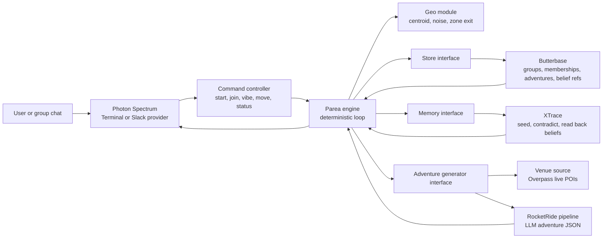
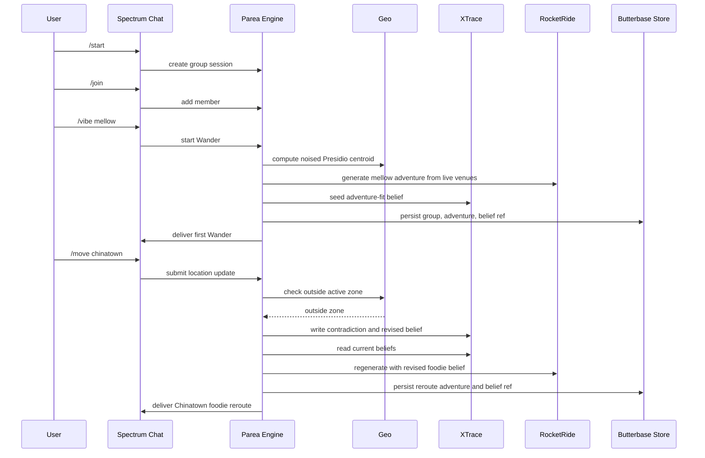

# Parea Wander

Parea Wander is a TypeScript/Node hackathon demo for a group-adventure agent that starts in a messaging app, computes a privacy-safe group meeting point, generates an adventure from live venue data, and reroutes when the group leaves the current zone. The demo path is: start a mellow Wander near the Presidio, simulate the group moving to Chinatown, revise the belief, regenerate a foodie adventure from live venues, and deliver the reroute to the chat.

## Sponsor Integrations

RocketRide is the adventure generation engine. [pipelines/parea-adventure.pipe](pipelines/parea-adventure.pipe) defines the chat to LLM to response pipeline, and [src/rocketrideAdventureGen.ts](src/rocketrideAdventureGen.ts) invokes it through the RocketRide TypeScript SDK. The generator feeds candidate venues and the current XTrace belief into RocketRide and validates the returned JSON before delivery.

XTrace is the belief memory layer. [src/xtraceMemory.ts](src/xtraceMemory.ts) writes the initial adventure-fit belief, writes the zone-exit contradiction, reads current beliefs back, and feeds the revised belief into reroute generation. [src/engine.ts](src/engine.ts) keeps the reroute decision deterministic with a zone-distance check, not an LLM judgment.

Butterbase is the persistent application state backend. [src/butterbaseStore.ts](src/butterbaseStore.ts) implements the `Store` interface for groups, memberships, adventures, and XTrace belief refs using `@butterbase/sdk`. The required table contract is documented in [docs/butterbase-schema.json](docs/butterbase-schema.json). If `BUTTERBASE_APP_ID` is unset, the app falls back to the in-memory store for local smoke tests.

Photon/Spectrum is the messaging delivery layer. [src/spectrumApp.ts](src/spectrumApp.ts) starts the configured Spectrum provider and routes text commands through the same Parea command controller. Terminal is the reliable local provider. Slack is included through `spectrum-ts/providers/slack` and can run with either Spectrum Cloud credentials or direct Slack team/token env vars.

## Setup

Prerequisites:

- Node.js 22 or newer
- npm 10 or newer
- RocketRide local engine running for RocketRide-backed generation

Install:

```bash
npm install
cp .env.example .env
npm run check
```

Important env vars:

```bash
SPECTRUM_PROVIDER=terminal
VENUE_SOURCE=overpass
ROCKETRIDE_URI=http://localhost:5565
ROCKETRIDE_APIKEY=
ROCKETRIDE_ADVENTURE_PIPELINE=pipelines/parea-adventure.pipe
ROCKETRIDE_OPENAI_KEY=
XTRACE_API_KEY=
XTRACE_ORG_ID=
BUTTERBASE_APP_ID=
BUTTERBASE_ANON_KEY=
SPECTRUM_PROJECT_ID=
SPECTRUM_PROJECT_SECRET=
SLACK_TEAM_ID=
SLACK_BOT_TOKEN=
SLACK_CHANNEL=
```

For RocketRide local mode, the VS Code extension may choose a dynamic port. If it does, override `ROCKETRIDE_URI` for the command, for example:

```powershell
$env:ROCKETRIDE_URI='http://localhost:61709'
```

## Judge Demo

Use [JUDGES_DEMO.md](JUDGES_DEMO.md) as the live runbook. Judges communicate with Parea by typing into a Spectrum chat provider:

- Terminal provider for the reliable local demo.
- Slack provider when Slack credentials are ready.

Start the judge-facing chat demo:

```powershell
$env:SPECTRUM_PROVIDER='terminal'
$env:VENUE_SOURCE='overpass'
$env:ROCKETRIDE_URI='http://localhost:61709'
npm run judges:demo
```

Then type the judge-friendly script:

```text
I am in
we want something mellow
we moved to Chinatown
where are we?
```

The slash command equivalents still work: `/join`, `/vibe mellow`, `/move chinatown`, and `/status`.

## Demo Commands

Run the automated full-loop smoke:

```powershell
$env:ROCKETRIDE_URI='http://localhost:61709'
$env:VENUE_SOURCE='overpass'
npm run full-loop:smoke
```

A successful smoke prints two deliveries: the initial Presidio mellow Wander, then a Chinatown foodie reroute.

Run the interactive terminal chat:

```bash
npm run dev:chat
```

In the terminal chat, use:

```text
/start
/join
/vibe mellow
/move presidio
/move chinatown
/status
```

To run Slack, set `SPECTRUM_PROVIDER=slack`. Either set `SPECTRUM_PROJECT_ID` and `SPECTRUM_PROJECT_SECRET` for Spectrum Cloud, or set `SLACK_TEAM_ID` and `SLACK_BOT_TOKEN` for direct Slack mode. The same text commands work in Slack.

## Useful Scripts

- `npm run dev` runs the canned full loop with configured integrations and console delivery.
- `npm run dev:chat` starts the configured Spectrum provider, terminal by default.
- `npm run judges:demo` starts the judge-facing Spectrum chat demo.
- `npm run full-loop:smoke` runs the reproducible Presidio to Chinatown reroute path.
- `npm run adventure:smoke` smoke-tests venue-backed adventure generation.
- `npm run xtrace:smoke` smoke-tests XTrace seed, contradiction, and read-back.
- `npm run check` runs lint, typecheck, tests, and build.

## Privacy

Parea never persists individual member coordinates. Raw user GPS points are used transiently to compute a noised group centroid, then discarded. The only location persisted by the store is the generated adventure zone center and radius. The rule is enforced by the store contract in [src/store.ts](src/store.ts) and the centroid logic in [src/geo.ts](src/geo.ts).

## Architecture

Parea is built around a small engine with sponsor tools behind explicit adapters. The same engine runs in the automated smoke test, terminal chat, and Slack chat.



The reroute trigger is deterministic: [src/engine.ts](src/engine.ts) checks whether the current noised group centroid is outside the active adventure zone. The LLM writes adventure content only. It does not decide whether to reroute.

## User Flow

The demo is designed to be reproducible: a mellow Presidio start, a simulated move to Chinatown, then a foodie reroute.



## Branch Plan

Each implementation slice is built on its own branch, pushed to GitHub, and opened as a normal PR for manual review before the next slice starts.

1. `codex/01-bootstrap-hygiene`
2. `codex/02-core-stub-loop`
3. `codex/03-spectrum-terminal`
4. `codex/04-xtrace-spike`
5. `codex/05-rocketride-generation`
6. `codex/06-full-loop-butterbase-slack`
